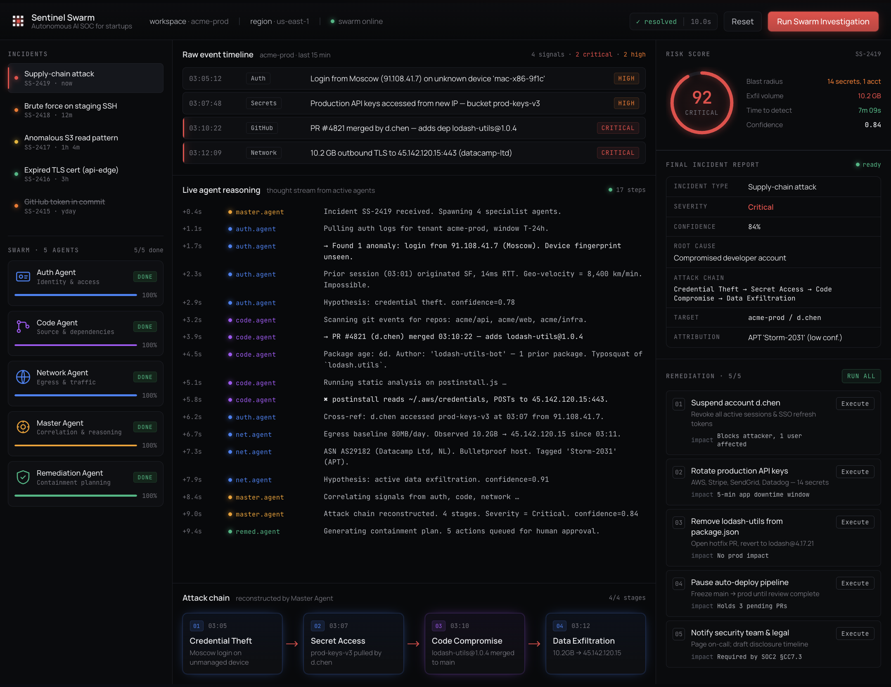

<div align="center">

<br/>

```
________            ______________           ___________________ 
____  _/_______________(_)_____  /_____________  /____  _/_  __ \
 __  / __  __ \  ___/_  /_  __  /_  _ \_  __ \  __/__  / _  / / /
__/ /  _  / / / /__ _  / / /_/ / /  __/  / / / /_ __/ /  / /_/ / 
/___/  /_/ /_/\___/ /_/  \__,_/  \___//_/ /_/\__/ /___/  \___\_\ 
```

**Autonomous AI SOC for Startups**

*Five specialist AI agents. One coordinated investigation. Zero human analysts required.*

<br/>

[](https://nextjs.org/)
[](https://www.typescriptlang.org/)
[](https://tailwindcss.com/)
[](https://openai.com/)
[](https://python.org/)

[](https://opensource.org/licenses/MIT)
[](https://ralphthon.team-attention.com/)
[]()

<br/>



</div>

---

## 🧠 What is IncidentIQ?

Most startups generate security alerts across five different systems — auth logs, GitHub, secrets vaults, CI/CD pipelines, network traffic. None of those alerts look critical in isolation. Together, they can be a coordinated attack.

**IncidentIQ is the analyst that connects them.**

Instead of a human SOC team jumping between dashboards, five specialized AI agents each investigate one evidence domain. A Master Correlation Agent then synthesizes their findings into a single attack narrative, identifies the root cause, and hands off to a Remediation Agent that generates a specific, evidence-referenced response plan.

The data is mock. The analysis is real — every agent makes genuine OpenAI API calls, and the output is different every single run.

---

## ⚡ The Demo

Select the **Supply-Chain Attack** scenario and click **Run Investigation**:

```
03:05  AUTH     Login from Moscow — unknown device, MFA passed         [HIGH]
03:07  SECRETS  Production API key accessed from new IP                 [HIGH]
03:10  GITHUB   New dependency added: lodash-utilz (typosquat)          [CRITICAL]
03:12  NETWORK  10.4 GB outbound → 45.142.120.15 (unapproved IP)        [CRITICAL]
```

Five agents investigate. The risk score climbs from 12% to 84%. The attack chain assembles itself:

```
Credential Theft → Secret Access → Malicious Dependency → Data Exfiltration
```

Root cause: compromised developer account. Time from first alert to full investigation: 90 seconds.

---

## 🤖 Agent Architecture

Each agent receives only the evidence relevant to its domain. The Master Agent receives the outputs of the four specialist agents — not the raw logs. This is genuine multi-agent chaining.

| Agent | Domain | Evidence Sources |
|---|---|---|
| 🔍 **Intake Agent** | First-responder triage | All log sources, window-filtered |
| 🔐 **Auth Agent** | Identity & credential analysis | `authEvents.json`, `secretsEvents.json` |
| 💻 **Code Agent** | Repository & supply chain | `githubEvents.json`, `cicdEvents.json`, `packageManifests.json` |
| 🌐 **Network Agent** | Traffic & exfiltration detection | `networkEvents.json`, `threatIntel.json` |
| 🧩 **Master Correlation Agent** | Attack chain reconstruction | All specialist outputs |
| 🛡️ **Remediation Agent** | Incident response planning | Master Agent output |

The investigation runs sequentially through `POST /api/investigate`. The frontend reveals results step by step with staged animations — but the underlying data is generated fresh each run.

### Fallback Safety

If the OpenAI API is unavailable or fails mid-investigation, `lib/fallbackInvestigation.ts` returns a complete deterministic result from `data/incidents/supply-chain-attack/expected/`. The demo never breaks.

---

## 🗂️ Project Structure

```
incidentiq/
├── app/
│   ├── api/
│   │   └── investigate/
│   │       └── route.ts          # POST /api/investigate — orchestrates all agent calls
│   └── page.tsx                  # Main dashboard
│
├── components/                   # UI components
│   ├── AgentStatusCard           # Per-agent status + findings
│   ├── AttackChain               # Animated chain visualization
│   ├── EventTimeline             # Raw security event feed
│   ├── IncidentReport            # Final report panel
│   ├── LiveReasoningFeed         # Streaming agent messages
│   ├── RemediationChecklist      # Response action list
│   └── RiskScorePanel            # Animated risk score
│
├── lib/
│   ├── agentPrompts.ts           # System/user prompts for each agent
│   ├── mockIncident.ts           # Log loader + evidence slicer
│   ├── runInvestigation.ts       # OpenAI orchestration logic
│   └── fallbackInvestigation.ts  # Deterministic fallback
│
├── data/
│   └── incidents/
│       └── supply-chain-attack/
│           ├── authEvents.json
│           ├── secretsEvents.json
│           ├── githubEvents.json
│           ├── cicdEvents.json
│           ├── networkEvents.json
│           ├── threatIntel.json
│           ├── packageManifests.json
│           └── expected/         # Fallback data — never sent to OpenAI
│
├── scripts/
│   ├── generate-mock-incident-data.py   # Regenerate log fixtures
│   ├── e2e-smoke.mjs                    # End-to-end smoke test
│   └── responsive-audit.mjs            # Responsive layout audit
│
├── docs/                         # Architecture and design notes
├── AGENTS.md                     # Codex/AI build instructions
├── OPENAI_AGENT_DESIGN.md        # Agent architecture spec
├── SPEC.md                       # Full product specification
└── DEMO_FLOW.md                  # Judge demo script
```

---

## 🚀 Getting Started

### Prerequisites

- Node.js 18+
- An OpenAI API key (the app runs in fallback mode without one)

### Installation

```bash
# Clone the repo
git clone https://github.com/Kk120306/Ralphthon.git
cd Ralphthon

# Install dependencies
npm install

# Configure environment
cp .env.local.example .env.local
# Add your OPENAI_API_KEY to .env.local

# Start the development server
npm run dev
```

Open [http://localhost:3000](http://localhost:3000).

### Environment Variables

```bash
# .env.local
OPENAI_API_KEY=sk-...   # Required for live agent reasoning
                        # App runs in fallback mode without this
```

### Regenerate Mock Data

```bash
python3 scripts/generate-mock-incident-data.py
```

---

## 🧪 Testing

```bash
# Type checking
npm run typecheck

# Lint
npm run lint

# End-to-end smoke test
npm run e2e:smoke

# Responsive layout audit
npm run e2e:responsive
```

---

## 🔒 MITRE ATT&CK Coverage

The supply-chain attack scenario maps to four confirmed techniques:

| ID | Technique | Agent |
|---|---|---|
| **T1078** | Valid Accounts | Auth Agent |
| **T1552** | Unsecured Credentials | Auth Agent |
| **T1195** | Supply Chain Compromise | Code Agent |
| **T1041** | Exfiltration Over C2 Channel | Network Agent |

---

## 🏗️ Tech Stack

<div align="center">

| Layer | Technology |
|---|---|
| **Framework** | Next.js 16 (App Router) |
| **Language** | TypeScript |
| **Styling** | Tailwind CSS v3 |
| **Icons** | Lucide React |
| **AI / LLM** | OpenAI API (`gpt-4o`) |
| **Data Generation** | Python 3 |
| **Testing** | Playwright |
| **Package Manager** | npm |

</div>

---

## 🎯 What's Real

This is a hackathon MVP. Here's an honest breakdown of what is and isn't real:

**✅ Real**
- OpenAI API calls for every agent (genuinely different output each run)
- Sequential agent chaining — Master Agent receives specialist outputs, not raw logs
- Realistic mock log fixtures generated from real log schemas (Okta, Vault, GitHub, VPC)
- MITRE ATT&CK framework mappings
- Deterministic fallback for demo reliability
- `lodash-utilz` typosquat detection (real attack pattern)

**🔶 Simulated for MVP**
- Log ingestion from live sources (CloudTrail, Okta, Splunk)
- GitHub PR creation (shown as AI-generated diff output, no real GitHub API calls)
- Real-time streaming of agent tokens (results returned in one batch, revealed progressively)

---

## 📋 API Reference

### `POST /api/investigate`

Runs the full multi-agent investigation pipeline.

**Request body** (optional):
```json
{
  "scenarioId": "supply-chain-attack"
}
```

**Response shape:**
```json
{
  "incidentName": "Supply-Chain Attack via Compromised Developer Account",
  "severity": "Critical",
  "riskScore": 84,
  "confidence": 84,
  "rootCause": "Compromised developer account (alex.chen@acmefin.dev)",
  "attackChain": ["Credential Theft", "Secret Access", "Malicious Dependency", "Data Exfiltration"],
  "agentFindings": [...],
  "mitreMappings": [...],
  "remediationChecklist": [...],
  "finalReport": { "summary": "...", "timeline": [...], "evidenceSummary": [...] },
  "meta": { "usedOpenAI": true, "scenarioId": "supply-chain-attack" }
}
```

---

## 🗺️ Roadmap

The gap between this MVP and a production SOC platform is real integrations. The intelligence layer is already real.

- [ ] Live log ingestion (CloudTrail, Okta, Splunk webhooks)
- [ ] Real GitHub dependency scanning via GitHub API (public repos, no auth)
- [ ] OSV.dev CVE lookup on detected packages
- [ ] Auth log upload (CSV/JSON) with deterministic anomaly detection
- [ ] Second and third incident scenarios (Insider Data Leak, Ransomware Staging)
- [ ] False positive path — Master Agent concludes "insufficient evidence"
- [ ] Export incident report as PDF
- [ ] Human-in-the-loop approval for remediation actions

---

## 👥 Team

Built at **Ralphthon 2026** — Singapore — Impact Track

---

<div align="center">

**IncidentIQ turns fragmented startup security alerts into a coordinated AI investigation —**  
**giving small teams the visibility and response capability of a full security operations center.**

<br/>

*Built in one day. Powered by OpenAI. Deployed at Ralphthon 2026.*

</div>
